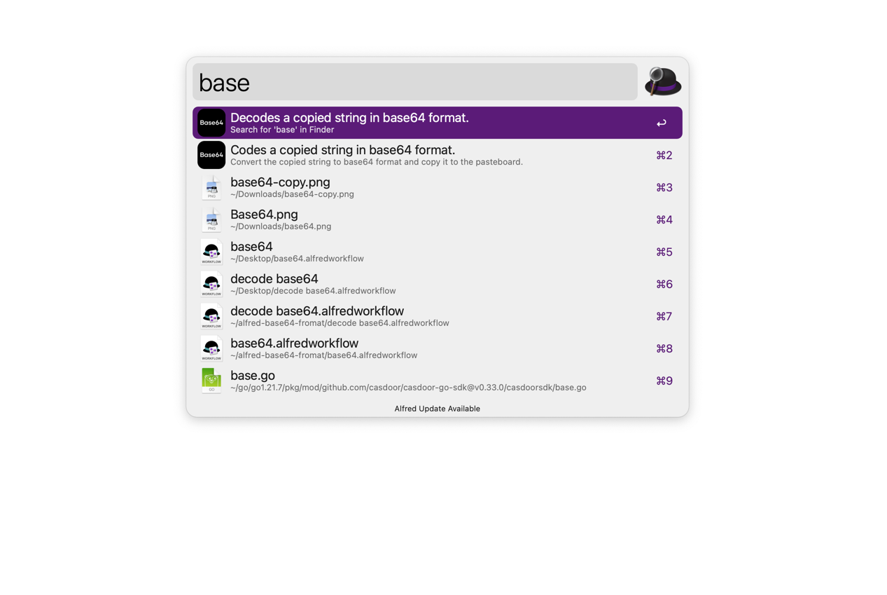

# Alfred-Base64-Format

# Overview

🤘An Alfred workflow that formatting a copied string to base64 and copy it to the pasteboard using `base64`.

# Install

You can get `Alfred-Base64-Format` via [release](https://github.com/mayooot/alfred-base64-fromat/releases)
or `git clone`
this repo.

~~~
git clone https://github.com/mayooot/alfred-base64-fromat.git
~~~

# Usage

You need to copy the string that needs to be formatted and invoke the Alfred shortcut, type `base64` and enter.

The formatted json will then appear on your pasteboard.

Select the second item if you want to format the string into base64 format,
or select the first item if you want to format base64 into origin format.

# Contribute

Feel free to open issues and pull requests. Any feedback is highly appreciated!